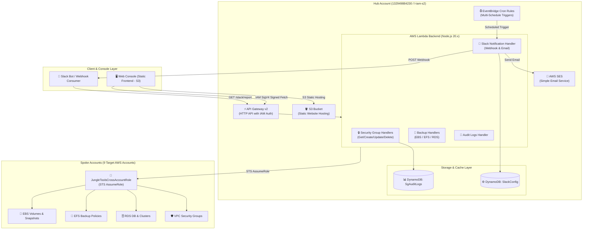

# Jungle Tools Console (AWS Multi-Account Operations & Backup Monitor)

다중 AWS 계정(Multi-Account: Hub + 9개 Spoke, 총 10개 계정) 환경에서 **EC2 보안 그룹(VPC Security Group)**의 통합 제어 및 **EBS / EFS / RDS 백업 상태**를 실시간 관제하고, **Slack 웹훅(Webhook)** 및 **AWS SES / SMTP 기반 이메일**로 맞춤형 일일 보고서를 자동 발송하는 클라우드 네이티브 서버리스 오퍼레이션 솔루션입니다.

---

## 🌟 주요 기능 (Key Features)

### 1. 🏠 최상단 `Home` 통합 대시보드 (Unified Operations Dashboard)
* **초기 랜딩 관제 페이지**: 애플리케이션 접속 시 첫 화면으로 전체 인프라 상태를 한눈에 조망.
* **SG Manage 관제 패널**: Active VPCs, Total Security Groups, Inbound Rules 실시간 집계 및 바로가기.
* **Backup Monitor 관제 패널**: Total Resources, Healthy (<=7d), Failure/Warning, Unprotected 지표 실시간 집계 및 바로가기.
* **비동기 병렬 동기화**: `Promise.allSettled` 기반 백그라운드 병렬 호출로 페이지 로딩 속도 최적화.
* **빠른 탐색 (Quick Access) 배너**: 알림 설정(Slack/Email) 및 보안 감사 로그 화면으로 원클릭 이동 지원.

---

### 2. 🛡️ VPC 보안 그룹 통합 관리 (SG Manage)
* **멀티 계정 보안 그룹 관리 (`SG Manage > Dashboard`)**:
  * Hub 계정 및 멀티 Spoke 계정의 VPC별 보안 그룹 목록 실시간 조회 및 검색.
  * 신규 보안 그룹 생성, 불필요한 보안 그룹 안전 삭제.
  * 인바운드 / 아웃바운드 방화벽 규칙(CIDR, Security Group ID, Port, Protocol) 실시간 추가 및 삭제.
* **보안 변경 감사 로그 (`SG Manage > Logs`)**:
  * 보안 그룹 생성, 삭제, 룰 변경 이력을 DynamoDB(`SgAuditLogsTable`)에 불변 기록하여 변경 내역 추적 및 감사 준수.

---

### 3. 💾 멀티 계정 백업 모니터링 (Backup Monitor)
* **종합 백업 관제판 (`Backup Monitor > Dashboard`)**:
  * **EBS 볼륨 & 스냅샷**: 볼륨 상태, 최신 스냅샷 생성 결과 및 경과일 기준 백업 상태(Healthy, Failure, Unprotected) 판별.
  * **EFS 파일 시스템**: EFS 파일 시스템 상태 및 자동 백업 정책(ENABLED / DISABLED) 실시간 점검.
  * **RDS DB 인스턴스 & 클러스터**: DB 인스턴스 상태, 수동/자동 스냅샷, Aurora 최신 복구 시점(`LatestRestorableTime`) 진단.
  * **헬스 상태 판별 기준**:
    * `Healthy` (정상): 최근 7일 이내 성공적인 백업/스냅샷 존재
    * `Failure` (실패/경고): 백업 오류 또는 8일 이상 경과된 오래된 백업
    * `Unprotected` (미보호): 백업 정책 또는 스냅샷이 전혀 없는 리소스

---

### 4. 🔔 멀티 채널 알림 관리 (Notification Center)

#### 💬 Slack 알림 (`Backup Monitor > Notification > Slack`)
1. **🔗 웹훅 (Incoming Webhook)**:
   * **다중 웹훅 지원**: N개의 슬랙 웹훅 URL 및 개별 크론 스케줄 관리.
   * **4가지 전송 메시지 타입**:
     * `summary`: 간결한 전체 요약 및 헬스 백분율 지표.
     * `report`: 리소스 종류별(EBS/EFS/RDS) 상세 마크다운 보고서.
     * `preview`: 즉각 조치가 필요한 Failure/Warning 리소스 상위 5건 집중 표시.
     * `full`: **10개 AWS 계정(Hub + 9개 Spoke) 전체**의 백업 현황을 계정 프로파일별로 리스팅.
2. **✉️ Email (Slack Channel Email)**:
   * 슬랙 채널 고유 이메일 주소 연동 및 SES 기반 표 형식(HTML) 일일 보고서 전송.

#### 📧 Email 알림 (`Backup Monitor > Notification > Email`)
1. **⚙️ SMTP 설정**:
   * AWS SES 또는 사내 메일 서버(SMTP Host, Port 587/465/25, 암호화 STARTTLS/SSL/TLS, 계정 인증) 설정.
   * 실시간 SMTP 핸드셰이크 연결 테스트 지원.
2. **👥 주소 등록**:
   * 백업 보고서를 수신할 담당자 이메일 주소록 관리 (등록, 수정, 삭제).
   * 수신자별 활성/일시정지 토글 및 활성 수신자 대상 즉시 테스트 발송 지원.

---

### 5. 🔒 엔터프라이즈 보안 강화 (Security Architecture)
* **API Gateway IAM 인증 (AWS SigV4)**: 모든 백엔드 HTTP API 엔드포인트에 IAM 인증 적용으로 무단 접근 차단.
* **IAM 최소 권한 원칙 (Least Privilege)**: Lambda 역할별 대상 Resource ARN 및 Action 최소화.
* **Slack Webhook SSRF 방지**: `https://hooks.slack.com/` 대상 엄격한 도메인 화이트리스트 검증.
* **DynamoDB SSE 암호화**: 저장 데이터(Rest Encryption)를 위한 AWS KMS / SSE 활성화.

---

## 🏗️ 시스템 아키텍처 (System Architecture)



---

## 📁 프로젝트 파일 구조 (Project Structure)

```text
aws_backup_monitor_2/
├── env.json                          # 🔒 local 환경변수 (자동 생성 / Git 제외)
├── env.example.json                  # ⚙️ 환경변수 샘플 템플릿
├── template.yaml                     # Hub 계정 SAM / CloudFormation 템플릿
├── spoke-account-template.yaml       # Spoke 계정 Cross-Account IAM Role 템플릿
├── backend/                          # AWS Lambda 백엔드 로직
│   ├── utils.mjs                     # 공통 SigV4, CORS, STS AssumeRole, DynamoDB 헬퍼
│   ├── getSecurityGroups/            # 보안 그룹 및 VPC 목록 조회
│   ├── createSecurityGroup/          # 보안 그룹 생성
│   ├── deleteSecurityGroup/          # 보안 그룹 삭제
│   ├── updateSecurityGroupRules/     # 인바운드/아웃바운드 규칙 일괄 수정
│   ├── getAuditLogs/                 # 보안 그룹 변경 감사 로그 조회
│   ├── getEbsSnapshots/              # EBS 볼륨 & 최신 스냅샷 상태 조회
│   ├── getEfsBackups/                # EFS 파일시스템 & 백업 정책 조회
│   ├── getRdsBackups/                # RDS 인스턴스/클러스터 & 스냅샷 조회
│   ├── getSlackConfig/               # Slack/Email 알림 설정 조회
│   ├── saveSlackConfig/              # Slack/Email 알림 설정 저장
│   └── sendSlackNotification/        # Slack Webhook (4개 메시지 타입) & Email 리포트 발송
├── frontend/                         # 프론트엔드 웹 콘솔 (Vanilla JS & Modern Dark CSS)
│   ├── config.js                     # 🔒 프론트엔드 API 엔드포인트 설정 (자동 생성)
│   ├── app.js                        # 대시보드 라우터, SigV4 서명, API 연동 로직
│   ├── index.html                    # Home, SG Manage, Backup Monitor, Notification UI
│   └── styles.css                    # 모던 다크 테마 및 반응형 디자인 시스템
├── scripts/                          # 배포 및 설정 자동화 스크립트
│   ├── deploy-all.sh / .ps1          # 백엔드 SAM 빌드/배포 + 프론트엔드 S3 동기화
│   ├── generate-env-json.sh / .ps1   # 로컬 AWS CLI 프로파일 기반 env.json 생성
│   ├── setup-all-spokes.sh / .ps1    # 9개 Spoke 계정 IAM Role 일괄 배포
│   └── setup-spoke-account.sh / .ps1 # 단일 Spoke 계정 IAM Role 배포
├── README.md                         # 프로젝트 안내 문서 (한국어)
└── README_EN.md                      # Project Documentation (English)
```

---

## 🚀 빠른 시작 및 배포 가이드 (Quick Start & Deployment)

### 1. 사전 준비 (Prerequisites)
* **Node.js (v20.x 이상)** & **npm**
* **AWS CLI (v2.x 이상)**: `~/.aws/credentials`에 Hub 프로필(`l-iam-s2`) 및 Spoke 프로필 등록
* **AWS SAM CLI (v1.100 이상)**: 백엔드 빌드 및 배포용

### 2. Spoke 계정 Cross-Account Role 배포
관리 대상이 되는 모든 Spoke 계정에 Hub 계정 신뢰 IAM 역할을 일괄 배포합니다:
```bash
# Linux / macOS
chmod +x ./scripts/setup-all-spokes.sh
./scripts/setup-all-spokes.sh

# Windows (PowerShell)
.\scripts\setup-all-spokes.ps1
```

### 3. 전체 인프라 원클릭 배포 (`deploy-all.sh`)
Hub 계정에 백엔드 SAM 스택과 프론트엔드 정적 웹사이트를 한 번에 빌드 및 배포합니다:
```bash
# Linux / macOS
chmod +x ./scripts/deploy-all.sh
./scripts/deploy-all.sh l-iam-s2 ap-northeast-2

# Windows (PowerShell)
.\scripts\deploy-all.ps1 -HubProfile l-iam-s2 -Region ap-northeast-2
```

> **배포 완료 시 출력되는 정보:**
> * **CloudFormation Stack**: `jungle-tools-stack`
> * **API Gateway Endpoint**: `https://<API_ID>.execute-api.ap-northeast-2.amazonaws.com`
> * **Frontend Website URL**: `http://<BUCKET_NAME>.s3-website.ap-northeast-2.amazonaws.com`

---

## 🖥️ 로컬 개발 및 테스트 (Local Development)

백엔드 배포 없이 프론트엔드 UI/UX만을 단독으로 로컬에서 테스트할 수 있습니다:

```bash
# 로컬 웹 서버 구동 (포트 3000)
python3 -m http.server 3000 --directory frontend
```

브라우저에서 **[http://localhost:3000](http://localhost:3000)** 접속 후:
* 로그인 팝업 우측 상단의 `×` 버튼을 누르면 자격 증명 없이도 **Home**, **SG Manage**, **Backup Monitor**, **Notification (Slack / Email)**의 모든 메뉴 전환과 UI 동작을 자유롭게 점검할 수 있습니다.

---

## 📄 라이선스 (License)

본 프로젝트는 사내 인프라 및 보안 관제 목적으로 제작되었으며, Apache 2.0 라이선스를 따릅니다.
