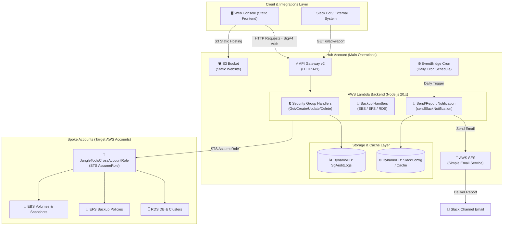
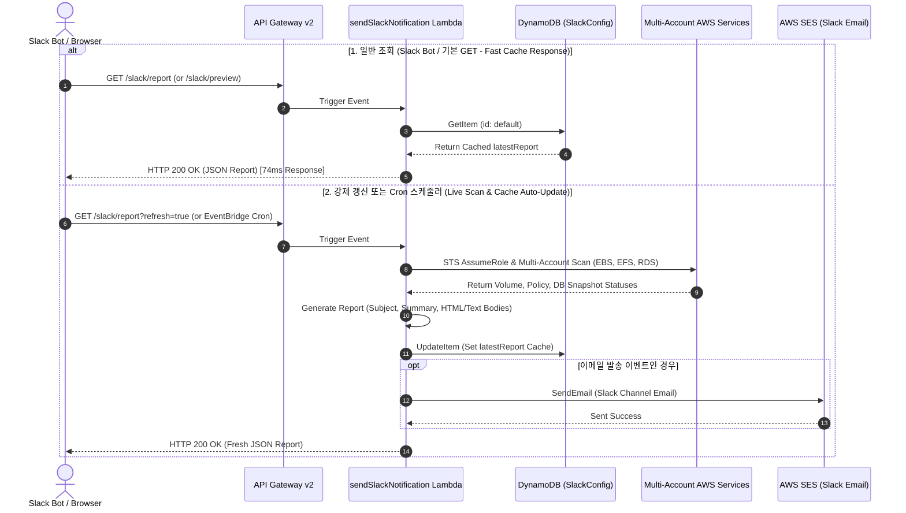

# Jungle Tools Console (AWS Multi-Account Operations & Backup Monitor)

다중 AWS 계정(Multi-Account) 환경에서 EC2 보안 그룹(VPC Security Group)의 통합 관리 및 EBS, EFS, RDS의 백업 상태를 실시간 모니터링하고, AWS SES 기반 슬랙 채널 이메일(Slack Channel Email)로 일일 백업 보고서를 자동 발송하는 서버리스 오퍼레이션 솔루션입니다.

---

## 🌟 주요 기능 (Key Features)

### 1. 🛡️ VPC 보안 그룹 통합 관리 (Security Group Management)
* **멀티 계정 보안 그룹 조회/생성/삭제**: Hub 계정 및 멀티 Spoke 계정의 VPC 보안 그룹 실시간 조회.
* **인바운드 / 아웃바운드 규칙 조작**: CIDR, Security Group ID 원격 규칙 추가 및 삭제.
* **감사 로그(Audit Logs) 기록**: DynamoDB 기반 변경 이력 저장 및 웹 콘솔 내 Audit Logs 탭 조회.

### 2. 💾 멀티 계정 백업 모니터링 (AWS Backup Monitor)
* **EBS 볼륨 & 스냅샷**: 각 계정별 EBS 볼륨 수량, 상태, 최신 스냅샷 생성 결과 기준 백업 상태(Healthy: 스냅샷 생성 성공, Failure: 스냅샷 생성 실패, Unprotected: 스냅샷 없음) 판별.
* **EFS 파일 시스템**: EFS 파일 시스템 상태 및 자동 백업 정책(ENABLED / DISABLED) 점검.
* **RDS DB 인스턴스 & Aurora 클러스터**: RDS DB 인스턴스, 수동/자동 스냅샷, Aurora DB 클러스터 최신 복구 가능 시간(`LatestRestorableTime`) 종합 진단.
* **통합 상태 계산**: `Unprotected`(백업 대상 미설정)를 제외한 전체 백업 대상 중 `Healthy` 비율을 실시간 산출.

### 3. 📩 Slack 채널 이메일 알림 (AWS SES Slack Notification)
* **AWS SES 기반 발송**: Slack 채널 이메일 주소(`example-channel@workspace.slack.com`)로 백업 리포트 전송.
* **표준 제목 형식**: `[YYYY년 MM월 DD일] 백화점BO 백업 모니터링 (Healthy 수량 / 전체 수량)`
* **상세 표 형식 리포트**: 각 AWS 프로필 계정별 EBS, EFS, RDS 스냅샷 수량, 헬스 상태, 최신 스냅샷 시각을 정돈된 HTML 테이블로 작성하여 전달.
* **스케줄링 & 대시보드 테스트**: 일일 자동 Cron(`cron(0 0 * * ? *)`) 발송 및 웹 대시보드 내 [Slack 설정] 모달을 통한 즉시 테스트 발송 지원.

---

## 📋 사전 요구 사항 (Pre-deployment Requirements)

### 1. 💻 로컬 개발 및 배포 도구 (Local Environment & CLI Tools)
* **Node.js (v20.x 이상) & npm:** 백엔드 Lambda 함수 의존성 패키지 설치용.
* **AWS CLI (v2.x 이상):** AWS 서비스 호출, 프로필 관리 및 S3 동기화용.
* **AWS SAM CLI (Serverless Application Model):** 백엔드 인프라(`template.yaml`) 빌드 및 CloudFormation 배포용.
* **PowerShell (Windows v5.1 이상) 또는 Bash (Linux/macOS):** 배포 자동화 스크립트 실행용.

### 2. 🔑 AWS 계정 및 IAM 권한 구조 (AWS Accounts & IAM Permissions)
* **Hub 계정 (메인 배포 계정):** S3 웹사이트, API Gateway, Lambda 백엔드, DynamoDB 감사/설정 테이블이 배포될 메인 계정 1개.
* **Spoke 계정들 (대상 관리 계정):** 보안 그룹 및 백업 현황을 원격으로 조회할 관리 대상 계정들 (`dev`, `test`, `prod` 등).
* **배포 자격 증명 권한:** CloudFormation, S3, IAM Role, AWS Lambda, API Gateway v2, DynamoDB, SES 생성/수정 권한.
* **오퍼레이터 자격 증명 (웹 콘솔 사용자):** IAM 사용자 Access Key, Secret Key 및 **Virtual MFA (OTP)** 기기 등록 필수.

### 3. 🌐 AWS CLI 프로필 세팅 (`~/.aws/credentials`)
배포 자동화 스크립트(`generate-env-json.sh` / `.ps1`, `setup-all-spokes.sh` / `.ps1`) 구동을 위해 로컬 PC의 `~/.aws/credentials` 파일에 Hub 계정 및 각 Spoke 계정에 접근할 수 있는 AWS CLI 프로필이 미리 정의되어 있어야 합니다:

```ini
# ~/.aws/credentials 예시

[l-iam-s2] ; Hub 계정 (메인 배포 계정) 프로필
aws_access_key_id = AKIA...
aws_secret_access_key = ...

[l-ellotte-dev] ; Spoke 계정 프로필 1
aws_access_key_id = AKIA...
aws_secret_access_key = ...

[l-b2-prd] ; Spoke 계정 프로필 2
aws_access_key_id = AKIA...
aws_secret_access_key = ...
```

---

## 🏗️ 시스템 아키텍처 (System Architecture)

### 1. 전체 아키텍처 구성도 (System Architecture Diagram)



### 2. Slack 리포트 & 초고속 캐싱 시퀀스 (Slack Report & Fast DynamoDB Caching Sequence)



---

## ⚙️ 환경 변수 설정 (Environment Configuration)

본 프로젝트는 로컬 PC의 AWS CLI 프로필 정보를 읽어 `env.json` 환경변수 파일을 **자동으로 생성**합니다.

```bash
# Bash / Linux / macOS
./scripts/generate-env-json.sh <YOUR_HUB_PROFILE>

# PowerShell (Windows)
.\scripts\generate-env-json.ps1 -HubProfile <YOUR_HUB_PROFILE>
```

자동 생성되는 `env.json` 예시:
```json
{
  "HUB_ACCOUNT_ID": "123456789012",
  "HUB_PROFILE": "l-iam-s2",
  "REGION": "ap-northeast-2",
  "SPOKE_PROFILES": [
    { "profile": "l-ellotte-dev", "accountId": "515303172277" },
    { "profile": "l-b2-prd", "accountId": "449512021474" }
  ]
}
```

> **💡 Lambda 환경 변수 자동 주입:**
> 배포 스크립트(`deploy-all.sh` / `deploy-all.ps1`) 실행 시 `env.json`에 정의된 Hub 및 Spoke 계정 목록(`SPOKE_PROFILES`)을 읽어 CloudFormation Parameter (`ScanTargetAccountsJson`)로 변환하며, 백엔드 AWS Lambda(`SendSlackNotificationFunction`)의 `SCAN_TARGET_ACCOUNTS` 환경 변수로 자동 주입됩니다.

---

## 🚀 단계별 배포 순서 (Deployment Sequence)

### 0단계: 환경 변수 자동 생성 (`env.json`)
```bash
./scripts/generate-env-json.sh <YOUR_HUB_PROFILE>
```

### 1단계: Hub 계정 백엔드 배포

> **전체 배포 스크립트로 한 번에 배포 가능합니다:**
> ```bash
> # Linux / macOS
> ./scripts/deploy-all.sh [HUB_PROFILE] [REGION]
> 
> # Windows (PowerShell)
> .\scripts\deploy-all.ps1
> ```
> **스크립트 수행 내용:**
> 1. 백엔드 의존성 패키지 설치 (`npm install`)
> 2. SAM 애플리케이션 빌드 (`sam build`)
> 3. SAM 애플리케이션 배포 (`sam deploy`)
> 4. CloudFormation Output에서 S3 버킷 정보 추출 후 프론트엔드 자동 동기화 (`aws s3 sync`)

---

## 📖 사용 설명서 (User Manual)

### 1. 사용자 자격 증명(MFA) 획득
MFA가 적용된 계정의 경우 터미널에서 임시 세션 토큰을 발급받습니다:

```bash
aws sts get-session-token \
    --serial-number arn:aws:iam::<HUB_ACCOUNT_ID>:mfa/<USERNAME> \
    --token-code <OTP_6자리_숫자> \
    --profile <HUB_PROFILE_NAME>
```

### 2. 웹 콘솔 접속 및 로그인
1. 브라우저로 S3 웹사이트 URL 접속 (`http://<YOUR_S3_BUCKET_NAME>.s3-website.<REGION>.amazonaws.com`)
2. 로그인 모달에 임시 키 정보 입력 (`AccessKeyId`, `SecretAccessKey`, `SessionToken`)
3. **[Sign In & Verify]** 버튼 클릭

### 3. 기능 탭 활용
* **보안 그룹 탭:** 대화형 테이블에서 VPC 보안 그룹 인바운드/아웃바운드 규칙 실시간 제어.
* **EBS / EFS / RDS 백업 모니터링 탭:** 멀티 계정 스냅샷 상태, Volume ID / Instance ID별 백업 헬스 체크 및 최신 스냅샷 일시 조회.
* **Slack 알림 설정 모달:** 
  * Slack Channel Email 수신 주소 및 발신자 이메일 주소 등록 및 저장.
  * **[테스트 이메일 전송]** 버튼을 통해 전체 계정 스냅샷 현황 이메일 리포트 즉시 테스트 가능.

---

## 📁 프로젝트 파일 구조 (Project Directory Structure)

```
aws_backup_monitor_2/
├── env.json                        # 🔒 local 환경변수 (자동생성 / Git 제외)
├── env.example.json                # ⚙️ 환경변수 샘플 템플릿 (Git 포함)
├── spoke-account-template.yaml     # Spoke 계정 IAM 역할 CloudFormation 템플릿
├── template.yaml                   # Hub 계정 SAM / CloudFormation 템플릿
├── backend/                        # AWS Lambda 백엔드 로직
│   ├── utils.mjs                   # 공통 CORS, STS AssumeRole, Client 생성 헬퍼
│   ├── getSecurityGroups/          # 보안그룹 및 VPC 목록 조회
│   ├── createSecurityGroup/        # 보안그룹 생성
│   ├── deleteSecurityGroup/        # 보안그룹 삭제
│   ├── authorizeSecurityGroupIngress/# 인바운드 규칙 추가
│   ├── revokeSecurityGroupIngress/  # 인바운드 규칙 삭제
│   ├── getAuditLogs/               # 감사 로그 조회
│   ├── getEbsSnapshots/            # EBS 볼륨 & 스냅샷 상태 조회
│   ├── getEfsBackups/              # EFS 파일시스템 & 백업정책 조회
│   ├── getRdsBackups/              # RDS 인스턴스/클러스터 & 스냅샷 조회
│   ├── getSlackConfig/             # Slack 이메일 알림 설정 조회
│   ├── saveSlackConfig/            # Slack 이메일 알림 설정 저장
│   └── sendSlackNotification/      # SES 기반 슬랙 채널 이메일 보고서 발송
├── frontend/                       # 프론트엔드 웹 콘솔
│   ├── config.js                   # 🔒 local 프론트엔드 환경변수 (자동생성 / Git 제외)
│   ├── config.example.js           # ⚙️ 프론트엔드 환경변수 샘플 (Git 포함)
│   ├── app.js                      # 메인 대시보드 및 백업 모니터링 컨트롤러
│   ├── styles.css                  # 어두운 다크 모드 스타일시트
│   └── index.html                  # 백업 모니터링 & 보안그룹 UI 레이아웃
├── scripts/                        # 배포 및 환경 자동화 스크립트
│   ├── deploy-all.sh / .ps1        # 전체 인프라 빌드 및 배포 자동화
│   ├── generate-env-json.sh / .ps1 # env.json 자동 생성
│   ├── generate-frontend-config.ps1# frontend/config.js 자동 생성
│   ├── setup-all-spokes.sh / .ps1  # Spoke 계정 IAM Role 일괄 배포
│   └── setup-spoke-account.sh / .ps1# 단일 Spoke 계정 IAM Role 배포
├── README.md                       # 프로젝트 문서 (한국어)
└── README_EN.md                    # 프로젝트 문서 (영어)
```
