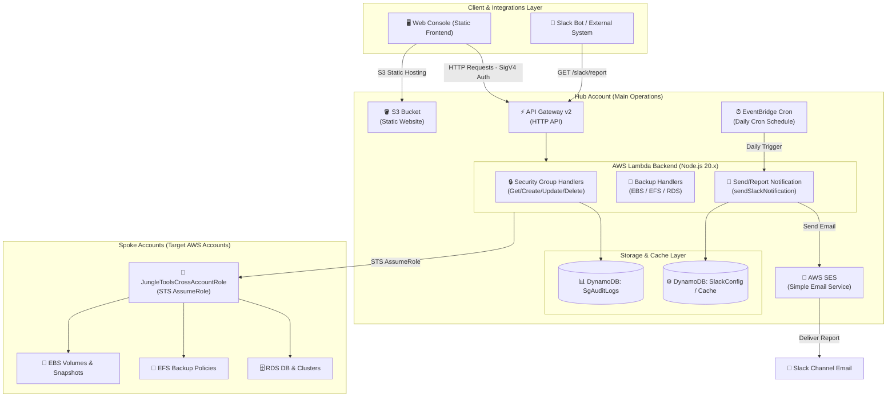
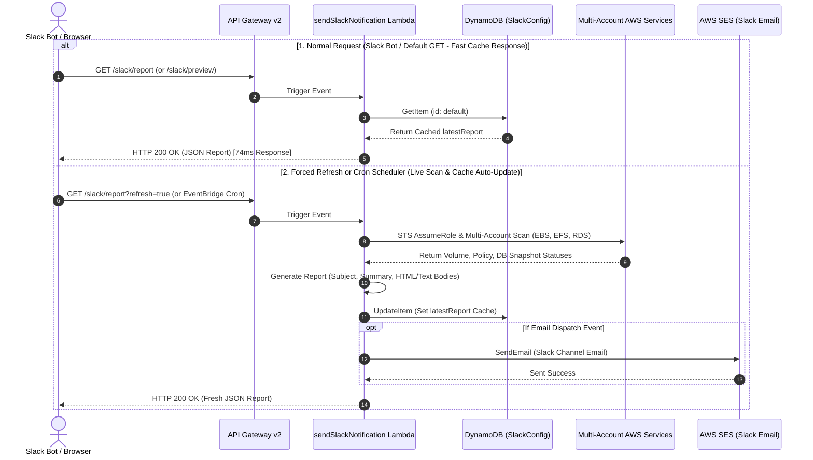

# Jungle Tools Console (AWS Multi-Account Operations & Backup Monitor)

A serverless operation solution designed to centrally manage EC2 Security Groups and monitor EBS, EFS, and RDS backup statuses across multiple AWS accounts from a single web console. It features automated daily backup health reports sent directly to Slack Channel Email via AWS SES.

---

## 🌟 Key Features

### 1. 🛡️ Multi-Account Security Group Management
* **Cross-Account Operations**: Centrally view, create, update inbound/outbound rules, and delete Security Groups across Hub and Spoke AWS accounts.
* **Audit Logging**: Store all rule modifications in DynamoDB (`SgAuditLogs`) and view detailed history in the Audit Logs tab.

### 2. 💾 Multi-Account AWS Backup Monitor
* **EBS Volume & Snapshot**: Track volume statuses, snapshot counts, and snapshot creation health criteria (`Healthy`: creation succeeded, `Failure`: creation failed, `Unprotected`: no snapshot).
* **EFS File Systems**: Monitor EFS file system status and automatic backup policies (`ENABLED` / `DISABLED`).
* **RDS & Aurora DB Clusters**: Monitor DB instances, manual/automated snapshots, and Aurora cluster `LatestRestorableTime`.
* **Healthy Target Ratio**: Calculate `Healthy` ratio excluding `Unprotected` resources in real time.

### 3. 📩 Slack Channel Email Reports (AWS SES)
* **AWS SES Email Integration**: Deliver daily backup reports to designated Slack Channel Emails (`example-channel@workspace.slack.com`).
* **Standard Subject Format**: `[YYYY-MM-DD] 백화점BO 백업 모니터링 (Healthy Count / Total Count)`
* **Comprehensive HTML Table Report**: Render detailed breakdown tables for EBS, EFS, and RDS snapshots per AWS account profile.
* **Scheduled Cron & Manual Testing**: Automate daily cron executions (`cron(0 0 * * ? *)`) and trigger instant test reports via the web modal.

---

## 📋 Pre-deployment Requirements

### 1. 💻 Local Environment & CLI Tools
* **Node.js (v20.x or higher) & npm:** Required for backend Lambda dependencies.
* **AWS CLI (v2.x or higher):** Required for AWS API invocations, profile management, and S3 sync.
* **AWS SAM CLI:** Required to build and deploy `template.yaml`.
* **PowerShell (Windows) or Bash (Linux/macOS):** Required for deployment scripts.

### 2. 🔑 AWS Accounts & IAM Permissions
* **Hub Account (Primary Account):** Main AWS account hosting S3, API Gateway, Lambda backend, DynamoDB, and AWS SES.
* **Spoke Accounts (Target Management Accounts):** AWS accounts (`dev`, `test`, `prod`, etc.) monitored remotely.
* **Deployer Permissions:** CloudFormation, S3, IAM Role, Lambda, API Gateway v2, DynamoDB, and SES permissions.
* **Operator Credentials:** IAM User Access Key, Secret Key, and registered **Virtual MFA (OTP)** device.

---

## 🏗️ System Architecture

### 1. Overall System Architecture Diagram



### 2. Slack Report & Fast DynamoDB Caching Sequence



---

## ⚙️ Environment Configuration

Automatically generate `env.json` from your local AWS CLI profiles:

```bash
# Bash / Linux / macOS
./scripts/generate-env-json.sh <YOUR_HUB_PROFILE>

# PowerShell (Windows)
.\scripts\generate-env-json.ps1 -HubProfile <YOUR_HUB_PROFILE>
```

Example `env.json`:
```json
{
  "HUB_ACCOUNT_ID": "123456789012",
  "HUB_PROFILE": "hub-profile",
  "REGION": "ap-northeast-2",
  "SPOKE_PROFILES": [
    { "profile": "l-ellotte-dev", "accountId": "515303172277" },
    { "profile": "l-b2-prd", "accountId": "449512021474" }
  ]
}
```

---

## 🚀 Deployment Sequence

### Step 0: Generate Environment Variables (`env.json`)
```bash
./scripts/generate-env-json.sh <YOUR_HUB_PROFILE>
```

### Step 1: Deploy Hub Account Backend & Frontend
```bash
# Linux / macOS
./scripts/deploy-all.sh [HUB_PROFILE] [REGION]

# Windows (PowerShell)
.\scripts\deploy-all.ps1
```

---

## 📁 Project Directory Structure

```
aws_backup_monitor_2/
├── env.json                        # 🔒 local env variables (git ignored)
├── env.example.json                # ⚙️ env template
├── spoke-account-template.yaml     # Spoke account IAM role CloudFormation template
├── template.yaml                   # Hub account SAM / CloudFormation template
├── backend/                        # AWS Lambda backend handlers
│   ├── utils.mjs                   # Shared helpers for CORS, STS AssumeRole, AWS Clients
│   ├── getSecurityGroups/          # Fetch security groups & VPCs
│   ├── createSecurityGroup/        # Create security group
│   ├── deleteSecurityGroup/        # Delete security group
│   ├── authorizeSecurityGroupIngress/# Add inbound rule
│   ├── revokeSecurityGroupIngress/  # Remove inbound rule
│   ├── getAuditLogs/               # Fetch audit logs
│   ├── getEbsSnapshots/            # Fetch EBS volumes & snapshots
│   ├── getEfsBackups/              # Fetch EFS file systems & backup policies
│   ├── getRdsBackups/              # Fetch RDS instances/clusters & snapshots
│   ├── getSlackConfig/             # Fetch Slack email notification config
│   ├── saveSlackConfig/            # Save Slack email notification config
│   └── sendSlackNotification/      # Dispatch SES Slack Channel Email report
├── frontend/                       # Frontend web console
│   ├── config.js                   # 🔒 local frontend config (git ignored)
│   ├── config.example.js           # ⚙️ frontend config template
│   ├── app.js                      # Main dashboard controller
│   ├── styles.css                  # Modern dark mode stylesheet
│   └── index.html                  # Main UI layout
├── scripts/                        # Automation scripts
│   ├── deploy-all.sh / .ps1        # Full build and deploy automation
│   ├── generate-env-json.sh / .ps1 # Generate env.json
│   ├── generate-frontend-config.ps1# Generate frontend/config.js
│   ├── setup-all-spokes.sh / .ps1  # Batch deploy Spoke IAM roles
│   └── setup-spoke-account.sh / .ps1# Deploy single Spoke IAM role
├── README.md                       # Project documentation (Korean)
└── README_EN.md                    # Project documentation (English)
```
